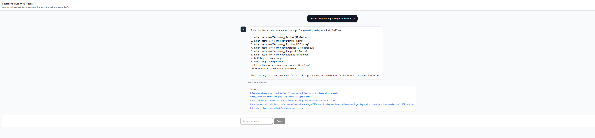

# AI Search Tool (LangChain + Next.js)



Este projeto é um motor de busca inteligente que utiliza Inteligência Artificial para decidir entre fornecer uma resposta direta ou realizar uma busca na web com sumarização de resultados, utilizando as ferramentas mais modernas de IA e desenvolvimento web.

---

## 🚀 Como Funciona

O sistema utiliza **LangChain Expression Language (LCEL)** no backend para orquestrar o fluxo de informações:

1.  **Roteamento Inteligente**: Uma estratégia de roteamento analisa a pergunta do usuário para decidir se precisa de busca na web (ex: notícias recentes, comparações de preços, rankings) ou se pode ser respondida diretamente pelo modelo de IA.
2.  **Web Pipeline**: Caso precise de busca, o sistema utiliza a API da **Tavily** para encontrar os melhores resultados, acessa as páginas, extrai o conteúdo e gera um resumo conciso.
3.  **Direct Pipeline**: Para perguntas simples, o modelo responde diretamente de forma rápida.
4.  **Validação**: O resultado final passa por uma camada de validação e "auto-correção" para garantir que o formato JSON de saída esteja sempre correto.

---

## 🛠️ Tecnologias Utilizadas

### Backend (`/agent`)
-   **Node.js & Express**: Servidor API robusto.
-   **LangChain**: Framework principal para orquestração de LLMs.
-   **Tavily**: Ferramenta de busca otimizada para agentes de IA.
-   **Provedores de LLM**: Suporte para Google Gemini, OpenAI e Groq.
-   **Zod**: Validação de esquemas e tipos.

### Frontend (`/client`)
-   **Next.js 15+**: Framework React com App Router.
-   **Tailwind CSS v4**: Estilização moderna e ultra-rápida.
-   **Radix UI**: Componentes acessíveis e customizáveis.
-   **Lucide React**: Biblioteca de ícones elegantes.

---

## ⚙️ Configuração e Execução

### 🐳 Rodando com Docker (Recomendado)

A maneira mais rápida e fácil. **O Docker cuida de tudo para você** (instalação de dependências e execução dos serviços).

1.  Certifique-se de que os arquivos `.env` na pasta `agent` e `client` estejam configurados corretamente.
2.  Na raiz do projeto, execute:

```bash
docker compose up --build
```

> [!TIP]
> Com este comando, você não precisa rodar `npm install` nem `npm run dev` manualmente. O ambiente já sobe pronto para uso.

O frontend estará disponível em `http://localhost:3000` e o backend em `http://localhost:5174`.

---

### 💻 Rodando Localmente

#### 1. Backend (Agent)

Navegue até a pasta do backend e instale as dependências:

```bash
cd agent
npm install
```

Crie um arquivo `.env` na raiz da pasta `agent` seguindo o modelo:

```env
MODEL_PROVIDER=gemini # ou openai, groq
GOOGLE_API_KEY=sua_chave_aqui
TAVILY_API_KEY=sua_chave_aqui
PORT=5174
ALLOWED_ORIGIN=http://localhost:3000
```

Inicie o servidor de desenvolvimento:

```bash
npm run dev
```

#### 2. Frontend (Client)

Navegue até a pasta do frontend e instale as dependências:

```bash
cd ../client
npm install
```

Inicie o servidor do Next.js:

```bash
npm run dev
```

---

## 📁 Estrutura do Projeto

-   `/agent/src/search_tool`: Contém toda a lógica da cadeia de busca (LCEL).
-   `/agent/src/routes`: Definição dos endpoints da API.
-   `/client/src/app`: Páginas e rotas do frontend Next.js.
-   `/client/src/components`: Componentes de interface reutilizáveis.
